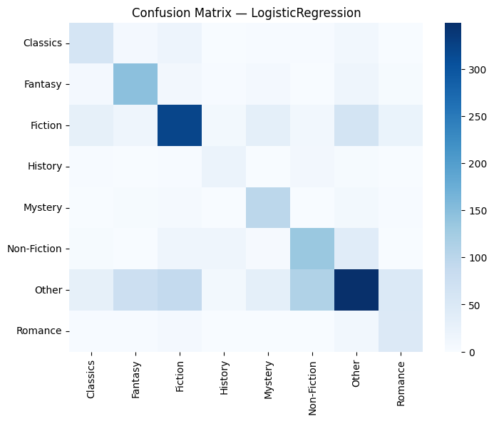

# 📚 Book Genre Classification using NLP and Machine Learning


This project classifies **book descriptions into genres** such as **Fiction**, **Fantasy**, **Non-Fiction**, **Romance**, **Mystery**, and more using **Natural Language Processing (NLP)** and **Machine Learning models**.  
It’s trained on a **Goodreads-style dataset** and features an **interactive dashboard** built using **ipywidgets** in Jupyter/Colab.

---
## 🧠 Abstract

The growing volume of digital book content on platforms such as Goodreads and Kindle necessitates efficient classification systems for organizing and recommending literature. This project presents a machine learning–based approach to automatically classify books into genres using textual descriptions. The dataset, containing thousands of book summaries, was preprocessed through tokenization, lemmatization, and stopword removal before feature extraction using TF-IDF vectorization. Three machine learning models—Logistic Regression, Naive Bayes, and Random Forest—were evaluated for performance. Logistic Regression achieved the highest accuracy of 46.85% and an F1-score of 0.4156, outperforming the other models in balancing precision and recall. The system also suggests similar books based on cosine similarity between TF-IDF vectors, providing an intelligent recommendation mechanism. The study demonstrates how NLP and traditional ML can be integrated effectively for genre prediction and content-based book recommendation.

---

### 🔑 Keywords
Natural Language Processing (NLP), Book Classification, Machine Learning, TF-IDF, Logistic Regression, Recommendation System

---

## 🧩 Project Overview

This project focuses on classifying book descriptions into genres such as **Fiction, Fantasy, Non-Fiction, Romance, Mystery, and more** using **Natural Language Processing (NLP)** and **Machine Learning** models.  
It is trained on a Goodreads-style dataset and features an **interactive dashboard** built using `ipywidgets` in Jupyter/Colab for live predictions.

The model predicts genres based on the text description of a book and also recommends **similar books** using cosine similarity on TF-IDF vectors.

---

## 🔧 Tech Stack

| Category | Tools |
|-----------|--------|
| **Language** | Python |
| **Libraries** | scikit-learn, pandas, numpy, matplotlib, nltk, wordcloud, ipywidgets |
| **Models** | Logistic Regression, Random Forest, Naive Bayes |
| **Features** | TF-IDF (bigrams) |
| **Visualization** | Matplotlib, WordCloud, ipywidgets |
| **Notebook Environment** | Google Colab |

---

## 🧩 Project Workflow (Step-by-Step)
## Model Flow

### 🏁 Step 0: Install & Import Libraries
All required libraries are installed and imported:
```python
import sklearn, pandas, numpy, matplotlib, nltk, wordcloud, ipywidgets
```
If missing, the code installs them via pip.  
✅ *Environment ready for NLP and visualization.*

---

### 📥 Step 1: Load & Inspect Dataset
Dataset loaded from `/content/goodreads_data.csv`.

✅ Output:
```
Dataset Loaded Successfully!
Shape: (10000, 5)
```

---
### 🧹 Step 2: Extract Primary Genre
Extracts the first genre from a list or comma-separated text.  
Keeps **Top 10 Genres**, assigns others as “Other”.

📊 Example Output:
```
Top Genres: ['Fiction', 'Fantasy', 'Non-Fiction', 'Romance', 'Classics', 'Mystery', ...]
Fiction        5843
Other          2551
Non-Fiction     829
Fantasy         306
Romance         213
Classics        178
Mystery          80
```

---

### 🧼 Step 3: Clean Text
Performed text preprocessing:
- Lowercasing  
- URL, HTML, punctuation removal  
- Lemmatization  
- Stopword removal  

✅ Creates column: `clean_desc`

---

### 🧩 Step 4: Split Dataset
```python
train_test_split(X, y, test_size=0.2, stratify=y)
```
✅ Balanced **80/20 train-test split** for fair model evaluation.

---

### 🔠 Step 5: TF-IDF Vectorization
Text transformed into numerical vectors:
```python
tfidf = TfidfVectorizer(max_features=25000, ngram_range=(1,2))
```
✅ Converts text → TF-IDF bigram features.

---

### ⚙️ Step 6: Train Models

| Model | Accuracy | F1 (Weighted) |
|--------|-----------|---------------|
| Naive Bayes | 0.3240 | 0.1846 |
| Random Forest | 0.4225 | 0.3305 |
| Logistic Regression | **0.4685** | **0.4156** |

🎯 **Best Model:** Logistic Regression (highest F1 score)


---

### 📊 Step 7: Evaluation
Detailed classification report + Confusion Matrix visualization.

#### Confusion Matrix (Logistic Regression)
X-axis → Predicted labels  
Y-axis → True labels  
Color → Correct/Incorrect density



---

### ☁️ Step 8: Word Cloud Generation
Colorful word clouds highlight the most frequent genre-wise keywords.

| Genre | Visualization |
|--------|----------------|
| Fiction |  |
| Fantasy |  |
| Romance |  |
| Non-Fiction |  |
| Classics |  |
| Mystery |  |
| History |  |
| Other |  |

📸 *Word Cloud Insights:*
- **Fiction:** “love, story, life, woman, world”  
- **Fantasy:** “magic, dragon, quest, power”  

---

### 💾 Step 9: Save Trained Artifacts
Saved models and vectorizers for reuse:
```
artifacts/
 ├── NaiveBayes.joblib
 ├── RandomForest.joblib
 ├── LogisticRegression.joblib
 ├── tfidf_vectorizer.joblib
 └── label_encoder.joblib
```

---

### 🧠 Step 10: Interactive Dashboard (ipywidgets)
An **interactive dashboard** lets users:
- 🔽 Select Model (NB / RF / LR)  
- 🧾 Input or Paste Description  
- 📂 Upload CSV for batch prediction  
- 🎯 Click “Predict Genre”

Outputs:
- Predicted genre  
- Top 5 probabilities  
- 5 most similar books (based on cosine similarity)

🎨 *Features:*
- Dark-themed output  
- Smooth predictions  
- Auto-scroll results  

🎥 Demo Output:  


---

## 📈 Key Insights
- Logistic Regression performs best due to linear separability in TF-IDF space.  
- Random Forest captures nonlinearity but slower.  
- Naive Bayes is lightweight but less accurate for overlapping genres.  
- Accuracy limited by genre overlap — could be improved with deep learning.

---

## 🚀 Future Improvements
- Integrate **BERT/DistilBERT embeddings**
- Use **book title + author metadata**
- Deploy as **Streamlit / Gradio web app**
- Add **active learning** for rare genres

---

## 🧑‍💻 Author
**Harshita Mahant**  
🎓 B.Tech CSE | Data Science & AI Enthusiast  
💡 Interests: NLP, Cloud Computing, and Analytics  
🌐 GitHub: [Harshitamahant](https://github.com/Harshitamahant)

---

## 🏁 Final Summary

| Step | Task | Output |
|------|------|--------|
| 0 | Install Libraries | Environment Ready |
| 1 | Load Dataset | Dataset Summary |
| 2 | Extract Genres | 10 Major Categories |
| 3 | Clean Descriptions | `clean_desc` Column |
| 4 | Split Data | 80/20 Train-Test |
| 5 | Vectorize | TF-IDF Matrix |
| 6 | Train Models | Accuracy Table |
| 7 | Evaluate | F1 Scores + Confusion Matrix |
| 8 | Word Clouds | Genre-wise Keywords |
| 9 | Save Artifacts | `.joblib` Files |
| 10 | Dashboard | Real-Time Predictions |

---
## 🧩 Conclusion

This project successfully demonstrates the application of Natural Language Processing (NLP) and machine learning for automated book genre classification and recommendation. By leveraging textual descriptions from Goodreads, the study applies TF-IDF vectorization to convert text into numerical representations suitable for model training. Among the three models evaluated—Naive Bayes, Random Forest, and Logistic Regression—the Logistic Regression model delivered the best overall performance with an accuracy of 46.85% and a weighted F1-score of 0.4156. The results suggest that linear models are well-suited for sparse textual features such as TF-IDF vectors. The inclusion of cosine similarity for generating similar book recommendations adds a practical recommendation layer to the system. Future work will explore the use of transformer-based models like BERT or DistilBERT to capture deeper contextual semantics, and integration with real-world book APIs for scalable deployment.

---

## 📚 References

[1] S. Bird, E. Klein, and E. Loper, *Natural Language Processing with Python*, O’Reilly Media, 2009.  
[2] F. Pedregosa *et al.*, “Scikit-learn: Machine Learning in Python,” *Journal of Machine Learning Research*, vol. 12, pp. 2825–2830, 2011.  
[3] T. Mikolov, K. Chen, G. Corrado, and J. Dean, “Efficient Estimation of Word Representations in Vector Space,” *arXiv preprint arXiv:1301.3781*, 2013.  
[4] J. Devlin, M.-W. Chang, K. Lee, and K. Toutanova, “BERT: Pre-training of Deep Bidirectional Transformers for Language Understanding,” *arXiv preprint arXiv:1810.04805*, 2018.  
[5] Goodreads Dataset, *Goodreads.com*, Accessed 2025.  
[6] H. Mahant, “Book Genre Classification using NLP and Machine Learning,” *GitHub Repository*, 2025. Available: [https://github.com/Harshitamahant](https://github.com/Harshitamahant)

## 🧩 Repository Structure

```
📂 BookGenreClassification/
 ├── goodreads_data.csv
 ├── Book_Review_Classification_.ipynb
 ├── Accuracy and F1 Score.png
 ├── Confusion_Matrix.png
 ├── word cloud fiction genre.png
 ├── word cloud fantasy genre.png
 ├── word cloud romance genre.png
 ├── word cloud classics genre.png
 ├── word cloud mystery genre.png
 ├── word cloud non fiction genre.png
 ├── word cloud History genre.png
 ├── word cloud other genre.png
 ├── Output view.mp4
 ├── artifacts/
 │   ├── LogisticRegression.joblib
 │   ├── tfidf_vectorizer.joblib
 │   └── label_encoder.joblib
 ├── README.md
 └── requirements.txt
```

## 🧾 Citation
If you use this project, please cite:
> **Harshita Mahant.**  
> *“Book Genre Classification using NLP and Machine Learning.”*  
> GitHub, 2025.

---

⭐ **If you like this project, give it a star on [GitHub](https://github.com/Harshitamahant/Machine-Learning-Theory)!**
